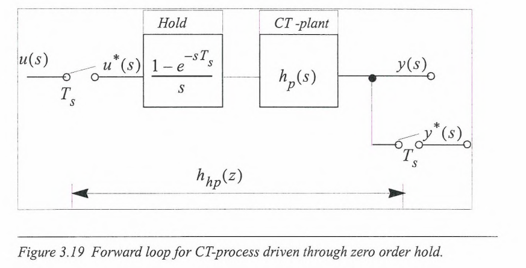
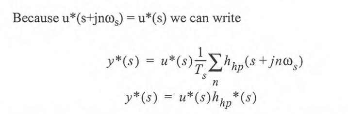
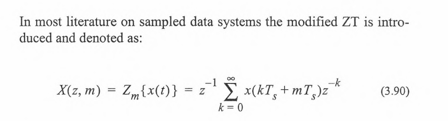

# Z-transformasjonen

**Mesteparten er hentet fra Norum-kompendiet**

- Matematikken vi har nå basserer seg på zero-order hold når vi går fra diskret til kontinuerlig.
- En ideell sampler er en som tar den nøyaktige verdien på det nøyaktige tidspunktet for målingen av et kontinuerlig signal.

- $x^*(s) =\frac{1}{T_s}\sum_{n=-\infty}^\infty x(s- jn\omega_s)$

  - Hvor x(s) er den laplace-dominerte av det kontinuerlige signalet $x^*(t)$
  - $*$ er en vanlig måte å vise at noe er et signal samplet fra ideell inpuls sampling.
  - $x^*(s) = \sum_{k=0}^\infty x(kT_s)e^{-skT_s }$

- For Fourier kan man skrive

  - $x^*(j\omega) = \frac{1}{T_s} \sum_{n=-\infty}^\infty x[j(\omega - n\omega_s)]$

- Og tilsvarende for Laplace kan man skrive 
  - $x(s) = \frac{1}{T_s} \sum_{k=0}^\infty x(s-jn\omega_s)$
- Om man sampler diskret vil man kopiere signalet i det diskrete Fourier-domenet, med avstand $\omega_s$ mellom hver av dem

  - Hvor $\omega_s$ er vinkelhastigheten til samplingen.

    - Som aliasing. Og om signalet har frekvenser $\omega_0$ i seg, hvor $\omega_0 >= \omega_s\cdot 2$ vil frekvensen dukke opp på et annet sted i signalet og vi får faktisk aliasing.

      - Dette fører til at man har fått et tap av informasjon.

  - Når man har en ikke-ideell sampling (Finite width pulse amplitude sampling) gir en annen faktor enn $\frac{1}{T_s}$. I stedet er det $\frac{p}{T_s}\left|\frac{sin(n\omega_sp/2)}{(n\omega_sp/2)}\right|$

    - Forsterkningne man måler $X^*(j\omega)$ med.
    - Om signalet ikke inneholder noen frekvenser over den Nyquist-frekvensen kan det bli fullstendig karakterisert av det diskretiserte signalet.

      - Det er mulig at crossover frequency og cutoff-frequency brukes litt om hverandre (?)
      - Typisk tommelfingerregel for sampling er 10*båndbredden, eller 3-4 ganger i løpet av rise-time

    - Man må ha en eller annen form for hold for å kunne gå fra de diskrete pulsene til det kontinuerlige domenet. Vanligvis er dette en zero-order hold.

    - Disse kan representeres som tidsforsinkede step-funksjoner i Laplace og Fourier-domenet.
    - Det er ikke mulig å finne en transfer-funksjon for en ideell sampler. Dette gjør det vanskeligere å analysere systemer.

## Rellasjonen mellom Laplace og z-transformasjonen

- Om man antar at det diskrete signalet $\{x(kT_s)\}$ kommmer fra en ideell sampling av et koninuerlig signal $x^*(t)$, og at $e^{T_s s} = z$.Da vil 

$$
x(z) = x^*(s) |_{e^{T_s s}}
$$

$$
e^{T_ss}= z
$$
$$
s = \frac{1}{T_s}ln(z)
$$

Siden at $u^* = \sum_{k=0}^\infty u(kT_s)e^{-skT_s}$, og fordi pulsene går gjennom en transfer-funksjon vil man få at $y(s) = h_p(s)u^*(s)$ 
- Det er ikke mulig å faktorisere ut den Laplace-transformerte til det kontinuerlige signalet u(t), så det er ikke mulig å lage en transfer-funksjon mellom inupten u(t) og outputen y(t). Dette er fordi systemet ikke er tidsinvariant. 

Man kan skrive $y(z) = u(z)h_{hp}(z)$ på grunn av 

Dette betyr at samplingen kan representeres av pulse transfer-funksjonen $h_{hp}(z) = - \frac{T_s}{ln(z)}( 1- z^-1)h_p(z)$. (Transfer-funksjonen fra en zero-order hold og prosessen. )

$$
h_{hp}(s) = \frac{1}{s}\left(  1 - e^{-sT_s} \right)h_p(s)
$$

## Dødtid 
$$
h_p(s) = h_p(s)e^{-T_ds}
$$
Vanligvis representeres dødtiden som en heltallsmultippel $mT_s$ av samplingstiden, og en forskjellsterm, slik at $T_d = (m-\epsilon)T_s$
  - $0\le\epsilon<1$
  - Man må ha en egen z-transformasjon for å håndtere $h(z,\epsilon) = Z_\epsilon\left[\frac{h(s)}{s}\right]$
    - Men alle reglene for vanlig z-transformasjon skal også gjelde for denne transformasjonen. 

$$
h_{hp}^*(s) = \frac{1}{T_s}\sum_n h_{hp}(s + jn\omega_s)
$$

Når man har kaskaderte systemer må man tenke seg om mens man lager den diskrete transfer-funksjonen. Noen regler er:

- Z-transformasjonen av to elementer i kontinuerlig tid, separert av en sampler er alltid produktet av de to z-transformasjonene. 
- Generelt sett kan man ikke få en transfer-funksjon for et system der inputene virker inn på et element i kontinuerlig tid før det blir samplet. 
  - (Dette utelukker ikke at man kan lage systemer med tilbakekoblinger)

